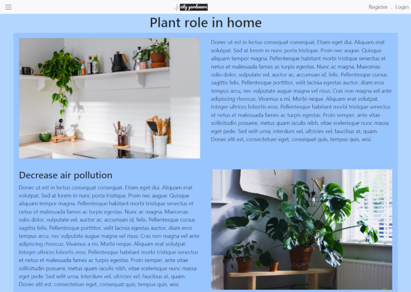
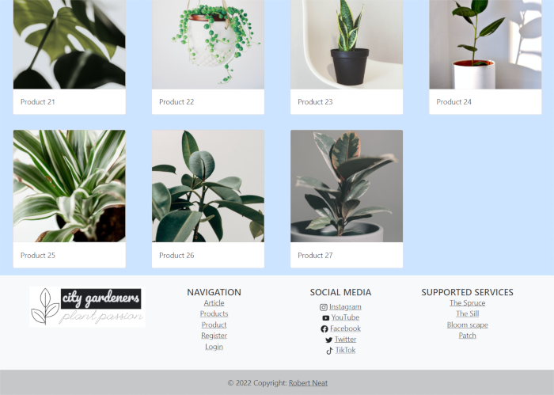
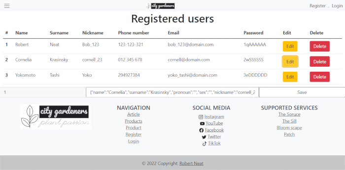

Figma prototype:[city_gardeners](https://www.figma.com/design/nPvXsTfBxH73CmVe1pcwuq/city_gardeners?t=uTpccr6mw96qptYp-1)

# Description:
Multi page website featuring JSON manipulation and localStorage as well as asynchronous data loading (AJAX) from another git repository. 
Works best with Visual Studio Code and live server. And finally grid system, so everybody can use website no matter the device.

# Functionality:
- Login users,
- User registration (saves data to local storage),
- Registered users data edit,
- Delete registered user,
- Displaying registered users,
- Loading stock data from external source (asynchronously),
- Generating and displaying gallery of all products (using javascript),
- Redirecting user to login page after product buy,
- Responsive layout using bootstrap grid system for all kind of users,

# Media and used resources:
All images are downloaded from unsplash.com (on free to use license), project isn't commericial - but it could be changed if necessary. Logo is created personally so it has no license connotation outside of this project. Website mackup is created using figma (can be accessed in "info/figma-prototype").

Copyright Robert Neat 06.2022
